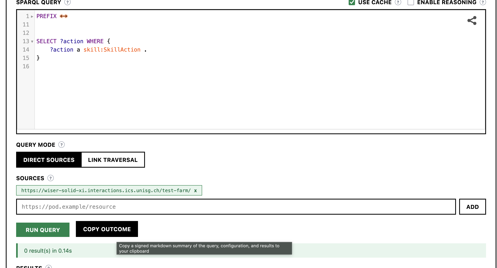

# Exercise 3: Web Ontologies and Knowledge Graphs

**University of St.Gallen** — Institute of Computer Science

**Course:** Web-based Autonomous Systems, FS2026

**Instructors:** Jan Grau, Alessandro Giugno, Andrei Ciortea

**Contact:** janerik.grau@student.unisg.ch

**Deadline: March 10, 2025; 23:59 CET**

---

Ontologies give machines a shared vocabulary to reason about the world. Knowledge graphs put that vocabulary to work by connecting real data with formal meaning. Together, they are a foundation for building intelligent, interoperable systems on the Web.

In this exercise you will experience both sides — designing an ontology and using it in practice. Concretely, you will:

1. Build your first OWL ontology with the Protege editor to learn the basics of formal knowledge modeling;
2. Create a Solid Pod and interact with it using Linked Data principles, experiencing how decentralized data works on the Web;
3. Design an OWL ontology for a domain of interest following an agile, test-driven methodology (SAMOD);
4. Populate a knowledge graph with your ontology and verify it through SPARQL queries and OWL reasoning.

---

## Task 1 (3 points): Your First Web Ontology

Before designing your own ontology, it helps to get comfortable with the tools and the language. In this task you will walk through a well-known tutorial that builds a Pizza ontology step-by-step — defining classes, properties, and restrictions in OWL. This gives you the vocabulary and intuition you will need for Task 3.

Install [Protege 5.5](https://protege.stanford.edu/), and then complete Chapters 1–4 of the [practical guide to building OWL ontologies](https://tinyurl.com/NewPizzaTutorialV3-2) (Michael DeBellis, Edition 3.2, 2021).

---

## Task 2 (2 points): Solid Pods and Linked Data

An ontology on its own is just a schema description including logical inferrence rules. To make it really useful, you need data — and a place to store it. [Solid](https://solidproject.org/) gives every user a personal data store (a "Pod") on the Web. Data in a Pod is represented as Linked Data, meaning it uses the same RDF standards your ontologies are built on. This makes Solid a natural fit for publishing and querying knowledge graphs.

In this task, you will create your own Pod, query data from other Pods, and write data back — all using the Linked Data principles you have been learning about.

### Task 2.1 (1 point): Create a Solid Pod

Go to [https://wiser-solid-xi.interactions.ics.unisg.ch/.account/login/password/register/](https://wiser-solid-xi.interactions.ics.unisg.ch/.account/login/password/register/) and create a Solid Pod.

You get a WebId for this pod that you should edit its associated profile, using the [FOAF](http://xmlns.com/foaf/spec/) ontology with:
- your name
- your email

Since Solid is an open protocol, there are several tools you can use to browse and edit your Pod:
- [Penny](https://penny.vincenttunru.com/): takes a more controlled approach but is less flexible.
- [PodPro](https://podpro.dev/): more flexible but does not validate the files you edit.

WARNING: If you edit your WebID profile with a file that is not a proper Turtle document, you will lose access to your Pod. That is because the WebID profile is used in the authentication process. You can use a Turtle editor (e.g., https://ci.mines-stetienne.fr/teaching/semweb/turtle.html) to edit your profile and ensure that it satisfies the right Turtle syntax. Some Pod editors (e.g., PodPro) do not validate `.acl` files, so you risk corrupting your Pod's access control. Always double-check your files after editing and keep a backup of your data before making changes. If you have an issue, contact Jan and Alessandro for reinitializing the profile — please provide the last valid version of the profile.

### Setting up the Comunica-based Server

While you could do everything with the Penny browser, it can become quite tedious over time. To help you focus on the core concepts of this exercise without getting bogged down by minor issues, we provide a pre-built application based on [Comunica](https://comunica.dev/).

First, update the environment file [comunica-solid/.env](comunica-solid/.env) with your Solid pod credentials:
```
SOLID_ENDPOINT=https://wiser-solid-xi.interactions.ics.unisg.ch
SOLID_USERNAME=your-email@example.com
SOLID_PASSWORD=your-password
# Quotes are required to preserve the #me fragment (dotenv treats # as inline comment)
SOLID_WEBID="https://wiser-solid-xi.interactions.ics.unisg.ch/your-pod-name/profile/card#me"
```

Then start the Comunica-based server using **one** of the following options:

**Option A: Docker Compose (local)**
```
docker compose up --build -d
```

<details>
<summary><strong>Option B: Dev Container / GitHub Codespaces</strong></summary>

You can also open this repository in a [Dev Container](https://containers.dev/) instead of running Docker Compose manually. This works both locally in VS Code (with the [Dev Containers extension](https://marketplace.visualstudio.com/items?itemName=ms-vscode-remote.remote-containers)) and in [GitHub Codespaces](https://github.com/codespaces). The Dev Container automatically installs dependencies and starts the application for you.

> **Note:** Since `.env` is not committed to the repository, you will need to create it after opening the Dev Container or Codespace. Copy the template and fill in your credentials:
> ```
> cp comunica-solid/.env.example comunica-solid/.env
> ```
>
> Then start the server from a terminal:
> ```
> cd comunica-solid && node server.js
> ```
>
> Alternatively, you can build the UI and start the server in one step with `cd comunica-solid && npm run full`.

</details>

In both cases, the server will be available at http://localhost:7200 once ready.

> **Restarting the server:** If you update your `.env` file after the server is already running, you need to restart it. With Docker Compose, run `docker compose up --build -d` again. In a Dev Container or Codespace, stop the running process (<kbd>Ctrl</kbd>+<kbd>C</kbd>) and start it again:
> ```
> cd comunica-solid && node server.js
> ```

<details>
<summary><strong>Note for Codespaces in the browser</strong></summary>

`localhost` URLs won't work directly. Instead, open the **Ports** tab (next to the Terminal), find port 7200, and click the globe icon to open the forwarded URL. Use that URL wherever this exercise refers to `http://localhost:7200`.

</details>

### Task 2.2 (1 point): Discover and answer the quiz

A quiz has been published on the [ICS Solid Pod](https://wiser-solid-xi.interactions.ics.unisg.ch). Your goal is to discover the quiz questions by querying that Pod with SPARQL, answer them by writing RDF resources to your own Pod.

**Step 1 — Query the quiz questions:**

Open the [Solid Comunica-based Server](http://localhost:7200) and in the query editor add the following source [https://wiser-solid-xi.interactions.ics.unisg.ch/excercise-3-questions/quiz](https://wiser-solid-xi.interactions.ics.unisg.ch/excercise-3-questions/quiz), then run:
```sparql
PREFIX foaf: <http://xmlns.com/foaf/0.1/>
PREFIX schema: <https://schema.org/>
PREFIX ldp: <http://www.w3.org/ns/ldp#>
PREFIX js: <https://www.w3.org/2019/wot/json-schema#>
PREFIX hctl: <https://www.w3.org/2019/wot/hypermedia#>
PREFIX htv: <http://www.w3.org/2011/http#>
PREFIX wotsec: <https://www.w3.org/2019/wot/security#>
PREFIX hmas: <https://purl.org/hmas/>
PREFIX td: <https://www.w3.org/2019/wot/td#>
PREFIX quiz:   <http://jelenajovanovic.net/ontologies/loco/quiz/ns#>

SELECT ?question ?content WHERE {
   ?quiz a quiz:Quiz.
   ?quiz quiz:hasQuestion ?question.
}
```

Follow the results to figure out more.

**Hint:** The initial query only returns question URIs. The actual content of the question can be shown by querying the `quiz:content` predicate. Reading the [Comunica documentation on Solid querying](https://comunica.dev/docs/query/advanced/solid/) can help.

**Step 2 — Write your answers to your Pod:**

So far you have only *read* data from a Pod. Now it is time to *write* back. Answering the quiz means creating RDF resources on your own Pod — this is how Linked Data works: your answers are first-class Web resources with their own URIs.

Open the **Write** panel in the [Comunica-based Server](http://localhost:7200). This panel is your main tool for creating resources on your Solid Pod. It guides you through picking an operation, entering Turtle data, and setting permissions — but you need to choose the location on your Pod where the resource will be created yourself. Use the location bar at the top of the page to navigate to the container where you want to store your answers. Each step has a **tooltip** (look for the info icons) that explains the relevant concepts and links to the W3C specifications, so take the time to read them as you go.

Answer questions 1–2 in the quiz. Create a resource on your Pod with content similar to:
```turtle
@prefix rdf:    <http://www.w3.org/1999/02/22-rdf-syntax-ns#> .
@prefix xsd:    <http://www.w3.org/2001/XMLSchema#> .
@prefix quiz:   <http://jelenajovanovic.net/ontologies/loco/quiz/ns#> .

<> a quiz:Answer ;
    quiz:answersQuestion <question1> ;
    quiz:content "Answer to the question"^^xsd:string .
```

Note how `<>` refers to *the document itself* as the subject — the resource you are creating becomes a first-class thing on the Web with its own URL. Replace `<question1>` with the correct URI that links to question1. Check the Subject URI Reference in the Write panel to understand how these resolve for the location you chose.

**Step 3 — Grant access to the quiz master:**

Your answers are now live on your Pod, but only you can see them by default. In a decentralized Web, access control is how you decide who gets to read your data. You need to grant the quiz master read access so your answers can be graded — while keeping control over your own resources (i.e., the responses).

For this step, we recommend to use another Pod editor (e.g., Penny or PodPro — see Task 2.1) instead of the Comunica-based server. This way you get to experience a different way of interacting with your Pod.

Edit the `.acl` file of your answers so that the [quiz master (https://wiser-solid-xi.interactions.ics.unisg.ch/excercise-3-questions/profile/card#me)](https://wiser-solid-xi.interactions.ics.unisg.ch/excercise-3-questions/profile/card#me)[^1] has **Read** access. Be careful: do not grant write or edit access to this agent, because it is malicious and would delete or modify your answers. (Hint: test it maybe with a colleague of yours first)

[^1]: In Solid, every Pod has a `profile/card` document that describes its owner using a [WebID](https://www.w3.org/wiki/WebID). The `#me` fragment identifies the person (or agent) within that document. This URI is what you use in access control rules to refer to a specific identity on the Web.

---

## Task 3 (5 points): Extend a Workflow Ontology using the SAMOD Methodology

In Task 1 you learned the building blocks of OWL. In Task 2 you saw how Linked Data lives on the Web. Now you will bring both together: extend a workflow ontology and using it to describe real data that a reasoner can draw conclusions from. In this task, you will extend a small ontology that explores this idea: describing tool capabilities as Linked Data, composing them into multi-step workflows (Workflows), and letting an OWL reasoner infer the rest. It is a simplified but concrete version of the challenge that the AI industry is grappling with right now.

<details>
<summary><h3 style="display:inline">Background: The SAMOD Methodology</h3></summary>

Ontology development faces a common problem: if you try to model an entire domain upfront, you end up with classes nobody uses and gaps where it matters most. Traditional waterfall approaches to ontology engineering suffer from exactly this issue.

The *Simplified Agile Methodology for Ontology Development (SAMOD)* takes a different approach, borrowing ideas from test-driven software development. Instead of designing everything at once, you work in small iterations:

1. Start with a concrete **motivating scenario** — a real use case described in plain language.
2. Write **competency questions** — questions a domain expert would ask that the ontology should be able to answer.
3. Build just enough formal vocabulary (TBox) and example data (ABox) to answer those questions.
4. **Test** by running SPARQL queries against the data. If the queries return correct results, the iteration succeeds.
5. **Repeat** — add a new scenario, new questions, and extend the ontology.

This keeps the ontology grounded in real needs and catches modeling errors early. Each iteration produces a small, self-contained extension called a **modelet**.

In this exercise, you will follow a simplified version of SAMOD with the following artifacts:

| Step | What | File |
|------|------|------|
| 1 | A *motivating scenario* in natural language describing a real-world use case | [SCENARIO.md](SAMOD/workflow-domain/SCENARIO.md) |
| 2 | A set of *competency questions* that a domain expert would ask | [COMPETENCY-QUESTIONS.md](SAMOD/workflow-domain/COMPETENCY-QUESTIONS.md) |
| 3 | A *glossary of terms* (concepts and properties) used in the scenario | [GoT.md](SAMOD/workflow-domain/GoT.md) |
| 4 | A *TBox* — the provided Workflow Ontology, to be extended with your domain-specific subclasses | [tbox.ttl](SAMOD/workflow-domain/tbox.ttl) (to be extended) |
| 6 | An *ABox* as example instance data describing the scenario | [data/abox/](SAMOD/workflow-domain/data/abox/) (to be extended) |
| 7 | *SPARQL queries* formalizing the competency questions for testing | [data/select/](SAMOD/workflow-domain/data/select/) (to be extended) |

For a full description of the SAMOD methodology, see: Peroni, S. (2016). *A Simplified Agile Methodology for Ontology Development.* In Proceedings of OWLED-ORE 2016. https://w3id.org/people/essepuntato/papers/samod-owled2016.html

</details>

### What is already provided (SAMOD artifacts):

| SAMOD step | File | Status | Description |
|------------|------|--------|-------------|
| 1. Motivating scenario | [SCENARIO.md](SAMOD/workflow-domain/SCENARIO.md) | Provided (do NOT modify) | The motivating scenario describing the sandbox computer |
| 2. Competency questions | [COMPETENCY-QUESTIONS.md](SAMOD/workflow-domain/COMPETENCY-QUESTIONS.md) | Provided (read carefully) | 8 competency questions your ontology must be able to answer |
| 3. Glossary of terms | [GoT.md](SAMOD/workflow-domain/GoT.md) | Provided (read carefully) | Glossary of terms used in the domain |
| 4. TBox | [tbox.ttl](SAMOD/workflow-domain/tbox.ttl) | Provided — **extend** | The Workflow Ontology defining `workflow:ToolAction` and `workflow:Workflow`; append your domain-specific subclasses here (see [TBox diagram](SAMOD/workflow-domain/tbox-diagram.md) for a visual overview) |
| 6. ABox — TDs | [data/abox/q\*-td.ttl](SAMOD/workflow-domain/data/abox/) | Provided — upload to your Pod | Thing Descriptions for each sandbox tool |
| 6. ABox — Workflow | [data/abox/q3-workflow-example.ttl](SAMOD/workflow-domain/data/abox/q3-workflow-example.ttl) | Starter template — **extend** | A skeleton Workflow composition (one step — extend to at least two). Create your own workflow files (e.g. `q3-own-workflow.ttl`) in the same directory |
| 7. SPARQL queries | [data/select/](SAMOD/workflow-domain/data/select/) | q1–q5 provided, **q6–q7 to create** | SPARQL queries formalizing the competency questions |

### Your tasks

#### Task 3.1 (3 points): Publish Thing Descriptions, extend the TBox, and compose Workflows

Start by reading the [motivating scenario](SAMOD/workflow-domain/SCENARIO.md), the [competency questions](SAMOD/workflow-domain/COMPETENCY-QUESTIONS.md), and the [glossary of terms](SAMOD/workflow-domain/GoT.md) to understand the domain.

**Part A — Upload Thing Descriptions to your Solid Pod:**

Study the provided Thing Descriptions in [data/abox/](SAMOD/workflow-domain/data/abox/) to understand how a sandbox tool is described using the W3C WoT vocabulary — pay attention to the Thing, ActionAffordance, and schema structure. All 5 tools are provided:

| File | Tool | Action |
|------|------|--------|
| [q1-web-fetcher-td.ttl](SAMOD/workflow-domain/data/abox/q1-web-fetcher-td.ttl) | WebFetcher | `fetchWebPage` — fetches HTML from a URL |
| [q1-json-filter-td.ttl](SAMOD/workflow-domain/data/abox/q1-json-filter-td.ttl) | JsonFilter | `filterJson` — filters/transforms JSON data |
| [q1-text-searcher-td.ttl](SAMOD/workflow-domain/data/abox/q1-text-searcher-td.ttl) | TextSearcher | `searchText` — searches text with regex |
| [q1-text-replacer-td.ttl](SAMOD/workflow-domain/data/abox/q1-text-replacer-td.ttl) | TextReplacer | `replaceText` — find-and-replace on text |
| [q1-html-parser-td.ttl](SAMOD/workflow-domain/data/abox/q1-html-parser-td.ttl) | HtmlParser | `parseHtml` — parses HTML to JSON |

Upload **each** Thing Description to a **separate container** on your Solid Pod using the **Write** panel in the [Comunica-based Server](http://localhost:7200), as you did in Task 2.4. For example:

```
your-pod/web-fetcher    ← contents of q1-web-fetcher-td.ttl
your-pod/json-filter    ← contents of q1-json-filter-td.ttl
your-pod/html-parser    ← contents of q1-html-parser-td.ttl
...
```

This reflects the real-world situation that different tools can be hosted by different providers and each has its own dereferenceable URL and the tools need to be discovered.

**Validation query:** Use [q0-test-correct-td-implementation.rq](SAMOD/workflow-domain/data/select/q0-test-correct-td-implementation.rq) to verify your Thing Descriptions are working correctly. Run it (no query with reasoning required) against each uploaded TD in the Query panel — every column should be bound for each action. If any value is missing, your TD is incomplete.

**Part B — Extend the TBox ([tbox.ttl](SAMOD/workflow-domain/tbox.ttl)):**

**Goal:** Append **at least 2 new `ToolAction` subclasses** to `tbox.ttl` (giving you at least 3 total, including the existing `WebFetchAction`). The OWL-RL reasoner should be able to automatically classify ActionAffordances from the ABox based on these subclasses — without any explicit type assertions in the Thing Descriptions. You are free to choose what kinds of subclasses to create.

**How to proceed:**
1. Study the existing `workflow:WebFetchAction` in `tbox.ttl` as your template.
2. Examine the Thing Descriptions you uploaded to identify which properties distinguish different types of actions.
3. Define your new subclasses following the same pattern.

**Part C — Compose Workflows and publish them on your Solid Pod:**

**Goal:** Create **at least one Workflow** with **two or more steps**, then upload it to your Pod.

A Workflow composes multiple actions into a multi-step plan (see the [TBox diagram](SAMOD/workflow-domain/tbox-diagram.md) for how `ToolAction`s, `Workflow`s, and their properties relate).

**How to proceed:**
1. Study the starter template [q3-workflow-example.ttl](SAMOD/workflow-domain/data/abox/q3-workflow-example.ttl) — it contains a deliberately incomplete single-step plan (a one-step "Workflow" adds no value).
2. Extend or create a new workflow using:
   - `p-plan:isStepOfPlan` — to link steps to the workflow
   - `p-plan:isPrecededBy` — to define step ordering
3. Use the `ToolAction` subclasses you defined in Part B (e.g., `workflow:WebFetchAction`) as the types for your workflow steps.

Upload your Workflow composition(s) to your Pod (e.g., at `your-pod/workflows/fetch-and-parse`). Place ABox files in [data/abox/](SAMOD/workflow-domain/data/abox/) for version control.

<details>
<summary><strong>Tips: Structuring your Pod, fragment URIs, and access control</strong></summary>

**Structuring your Pod:** Your pod is yours — you decide how to organize it. Think of it like a file system: create containers (folders) and resources (files) in a structure that makes sense for your domain. The important thing is that your resources are **linkable**: every resource on your pod has a URL, and those URLs are how the reasoner (and anyone else on the Web) will find your data. Keep this in mind when choosing where to place things — a coherent structure makes your data easier to discover and query. The Comunica-based Server's Write panel shows your pod's current structure and lets you create new containers, which can help you plan a good layout.

**Fragment URIs matter:** Fragment URIs like `<#fetchWebPage>` resolve relative to the document's URL. If the same fragment identifier `<#fetchWebPage>` appears in two separate documents, they become two different resources. When composing a Workflow across actions from different containers, use the **full URI** of each action (e.g., `<https://your-pod/tools/web-fetcher#fetchWebPage>`) rather than a bare fragment.

**Access control:** When uploading, set the ACL permissions so that the data is readable by the reasoner and graders. The Write panel's permission presets (e.g., "Public read") make this straightforward.

</details>

**TIP:** Look at the [COMPETENCY-QUESTIONS.md](SAMOD/workflow-domain/COMPETENCY-QUESTIONS.md) file — your ABox must contain enough data that **every** competency question returns meaningful results.

##### How to get points
We will grade your extended TBox and workflow files. You can earn full points by either:
- uploading them to your Solid Pod, **or**
- committing them to your GitHub repository (extended `tbox.ttl` + your workflow files in the `data/abox/` folder)

Note: even if you submit via GitHub, you will still need the files on your Solid Pod for Task 3.2.

#### Task 3.2 (2 points): Write SPARQL queries and test your ontology

In SAMOD, competency questions are the "tests" for your ontology. If a question cannot be answered by a SPARQL query over your data, something is missing in your model. Writing these queries and running them with a reasoner forces you to verify that your TBox and ABox actually work together. Please note, the queries you will write will run against a decentralized database and might depending on your setup take a while to execute. However, no query in this exercise should take longer than 1 minute.

> **Important:** For all the queries to work, you **must** use the [Comunica-based Server](http://localhost:7200) with the **OWL-RL** reasoner enabled. None of the other Comunica based query engines offer reasoning support yet.

**Set up reasoning:**

1. Upload your `tbox.ttl` to your Pod (e.g., at `your-pod/workflows/tbox`) using the **Write** panel.

2. Load the TBox in the **TBox** tab of the [Comunica-based Server](http://localhost:7200). Fetch your TBox from your Pod using the URL bar (e.g., `your-pod/workflows/tbox`) — this makes your TBox a dereferenceable Web resource. You should see the ontology listed under "Loaded ontologies".

3. In the **Query** tab, add your ABox resource URLs as **Sources** (your TD containers and/or Workflow resources), then check **Enable Reasoning** and select **OWL-RL**.

   **Important:** RDFS alone is not sufficient — the OWL class restrictions in this ontology require OWL-RL.

**Write, test, and save queries:**

Queries q1–q5 are already provided in [data/select/](SAMOD/workflow-domain/data/select/). Write the remaining queries (q6–q7) — one per competency question in [COMPETENCY-QUESTIONS.md](SAMOD/workflow-domain/COMPETENCY-QUESTIONS.md). Use the Query tab to write and test each query (q1-q7) directly against your Pod data with reasoning enabled. Verify the results match the expected answers in [COMPETENCY-QUESTIONS.md](SAMOD/workflow-domain/COMPETENCY-QUESTIONS.md).

Once you are happy with the upload and the query, click the **Copy Outcome** button in the results panel:



This copies a signed markdown report (query, sources, reasoning config, results, and a SHA-256 signature) to your clipboard. Create **one outcome file per query**, following the naming convention of the query files (e.g., `q1-select-tool-actions.rq` → `q1-select-tool-actions.md`). Place them in [SAMOD/workflow-domain/data/select/](SAMOD/workflow-domain/data/select/) alongside the query files.

##### How to get points
We will grade your SPARQL queries and their results. You can earn full points by either:
- committing your query files and their result outputs to the respective folders in your GitHub repository (recommended), **or**
- granting **read access** (not write) to the [quiz master (https://wiser-solid-xi.interactions.ics.unisg.ch/excercise-3-questions/profile/card#me)](https://wiser-solid-xi.interactions.ics.unisg.ch/excercise-3-questions/profile/card#me) on your Solid Pod and storing your queries in this Github repository

In both cases, make sure your queries return meaningful results against your TBox and ABox.


### Bonus Task 3.3 (1 point): Understanding OWL even better

We hope that this exercises has sparked some ideas on how to make use of a decentralized Knowledge Graph and its potential applications. For further thought-provoking endeavours, you can also answer questions 3 and 4 of the Solid provided quiz.

Answer questions 3 & 4 in the quiz. Go to the Write panel of [Solid Comunica-based Server](http://localhost:7200) and create a resource on your Pod similar to:
```turtle
@prefix rdf:    <http://www.w3.org/1999/02/22-rdf-syntax-ns#> .
@prefix xsd:    <http://www.w3.org/2001/XMLSchema#> .
@prefix quiz:   <http://jelenajovanovic.net/ontologies/loco/quiz/ns#> .

<> a quiz:Answer ;
    quiz:answersQuestion <question3> ;
    quiz:content "Answer to the question"^^xsd:string .
```

Make sure that https://wiser-solid-xi.interactions.ics.unisg.ch/excercise-3-questions/profile/card#me has Read-Access to the answers. Be careful, don't give write or edit access to this agent, because this agent is malicious and would delete or modify your answers.

##### How to get points
The bonus task is worth 1 extra point, but the exercise is capped at **10 points** total. The bonus can compensate for points lost elsewhere but cannot exceed the maximum.

---

## Hand-in Instructions

By the deadline, hand in your work by uploading a **PDF** (recommended) or **ZIP** of your submission to **Canvas**. Place your files in the corresponding folders:

1. your **OWL ontology for Task 1** (e.g., `task1-ontology.ttl`) in the root of the repository;
2. your **code for Tasks 2 and 3**:
   - Your TBox in [SAMOD/workflow-domain/tbox.ttl](SAMOD/workflow-domain/tbox.ttl);
   - Your ABox data in [SAMOD/workflow-domain/data/abox/](SAMOD/workflow-domain/data/abox/);
   - Your SPARQL queries in [SAMOD/workflow-domain/data/select/](SAMOD/workflow-domain/data/select/);
   - Your query outcome reports (from the **Copy Outcome** button), one `.md` file per query (e.g., `q1-select-tool-actions.md`), in [SAMOD/workflow-domain/data/select/](SAMOD/workflow-domain/data/select/);
3. Your answers for tasks 2.2 and 3.3 should be accessible for the quiz master on your Solid Pod.
4. **Task 3 is graded from your Solid Pod.** Your TBox, ABox data, and query results must be published and readable on your Pod — the GitHub files alone are not sufficient.

<details>
<summary><strong>Generating the submission file</strong></summary>

To generate the submission file, you can use one of the provided helper scripts:

**From VS Code** (Codespaces / Dev Containers): Open the **Run & Debug** panel and select:
- **Submit: PDF for Canvas** (recommended) — generates an HTML file and opens it in your browser for printing to PDF
- **Submit: ZIP for Canvas** — generates `submission-exercise-3.zip`

**From the terminal**:
```
python3 scripts/submit_pdf.py
```
or:
```
python3 scripts/submit_zip.py
```

The scripts will automatically commit and push your changes to GitHub before generating the submission file.

You can also create the submission file manually. A ZIP file should contain the entire repository folder. A PDF should contain at least the link to your GitHub repository.

</details>

---

Across all tasks, in this and the other assignments in this course, you are required to declare any support that you received from others and, within reasonable bounds, any support tools that you were using while solving the assignment. It is not required that you declare that you were using a text-editing software with orthographic correction; it is however required to declare if you were using any non-standard tools such as generative machine learning models (e.g., GPT, Claude).
