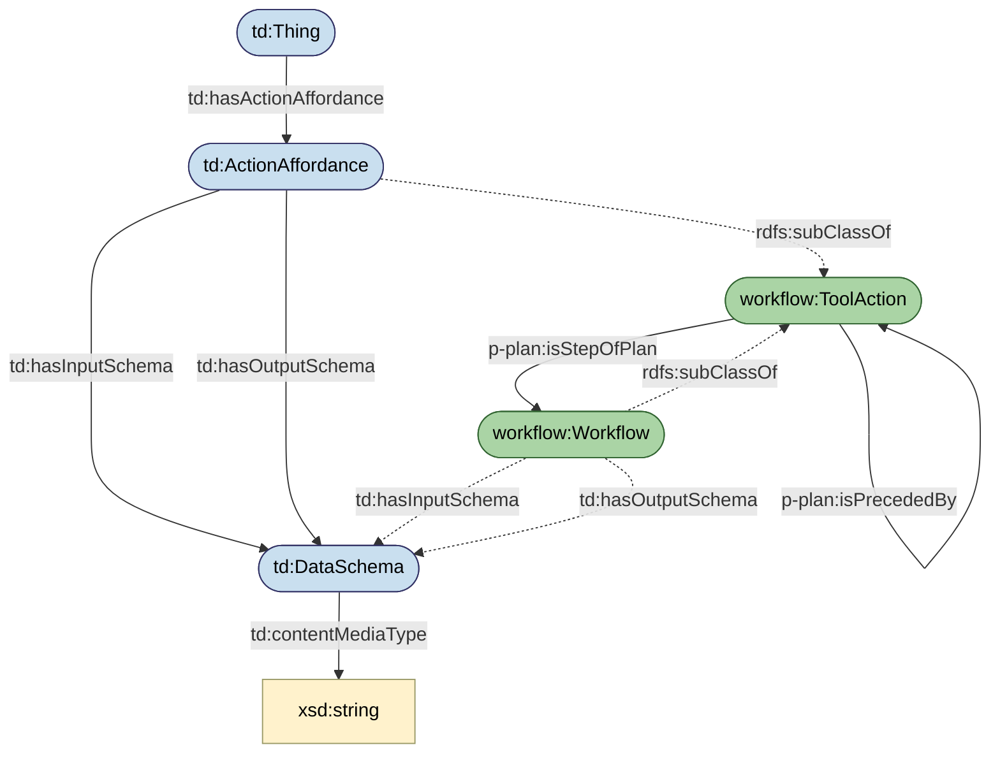
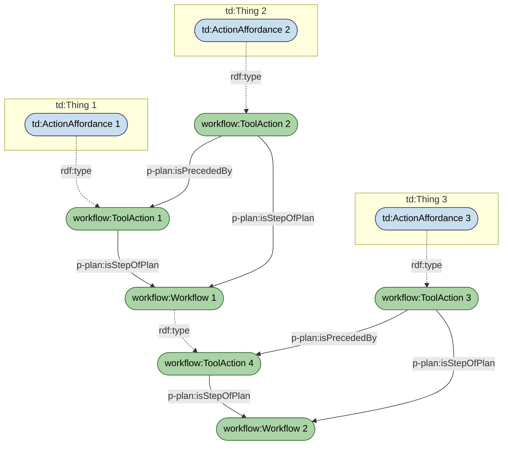

# Workflow Ontology — TBox Diagram

The Workflow ontology extends [W3C Web of Things (WoT) Thing Descriptions](https://www.w3.org/TR/wot-thing-description/) and [P-Plan](http://purl.org/net/p-plan#) to model composable tool actions. An **ActionAffordance** from a WoT Thing Description becomes a **ToolAction** when it has typed input and output schemas (see [GoT.md](GoT.md) for full definitions of all classes and properties). ToolActions can be composed into **Workflows** using P-Plan's `isStepOfPlan` and `isPrecededBy` properties. Because a Workflow is itself a ToolAction, workflows can be nested inside other workflows — enabling the recursive composability described in the [motivating scenario](SCENARIO.md).

## Example: Composable Workflows

The diagram below shows how the ontology enables recursive composability. Three WoT Things each expose an ActionAffordance. When an ActionAffordance declares both an input and output schema (with a `contentMediaType`), the reasoner classifies it as a **ToolAction**. ToolAction 1 and ToolAction 2 are then composed into Workflow 1 using `isStepOfPlan` and ordered with `isPrecededBy` (see [GoT.md — Properties](GoT.md#properties)). Since Workflow 1 is itself a ToolAction (ToolAction 4 — it declares its own schemas), it can be composed with ToolAction 3 into Workflow 2. This nesting can continue indefinitely: any Workflow that declares schemas becomes a ToolAction and can serve as a step in a higher-level Workflow.

